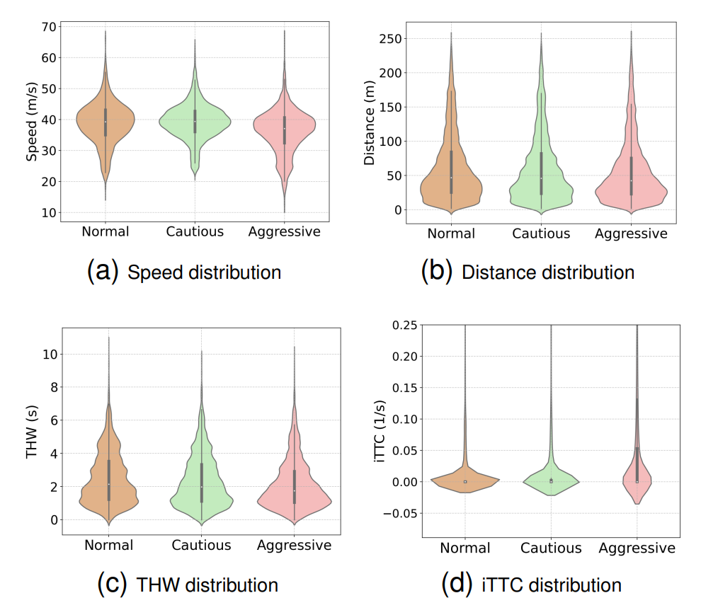
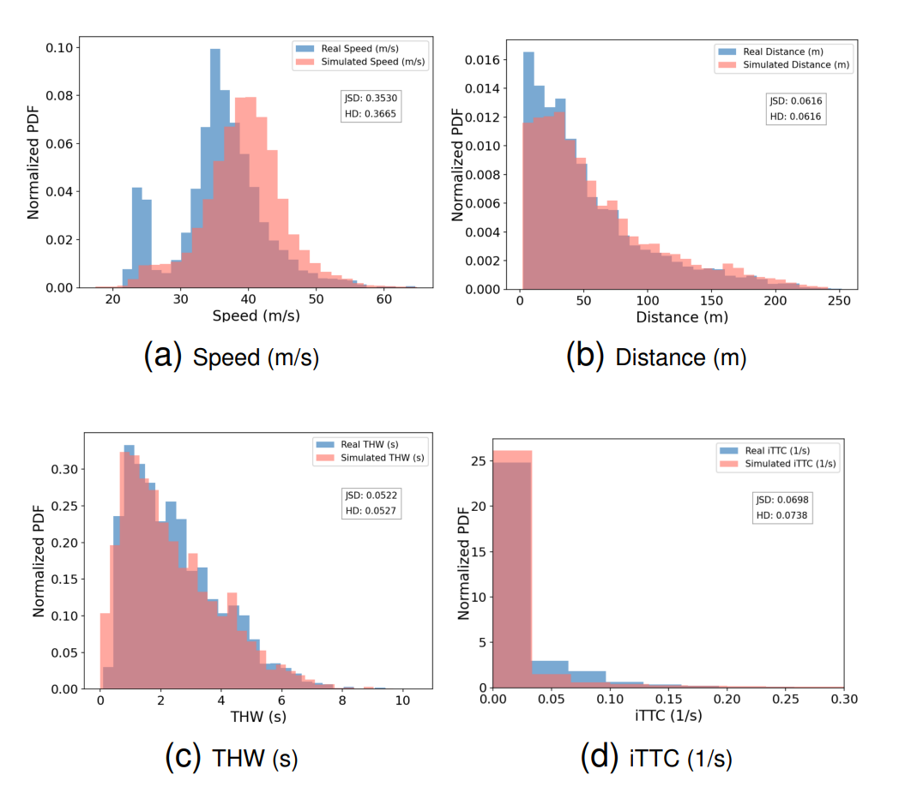
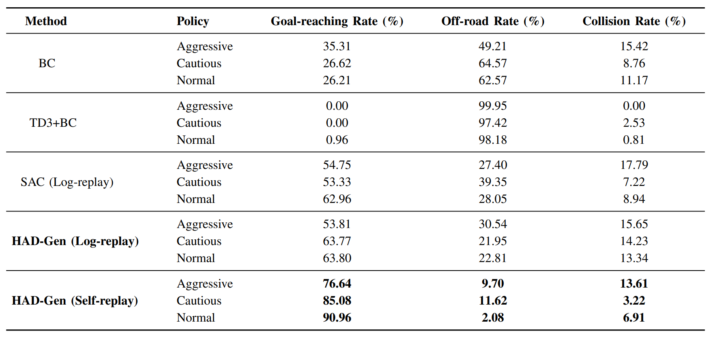
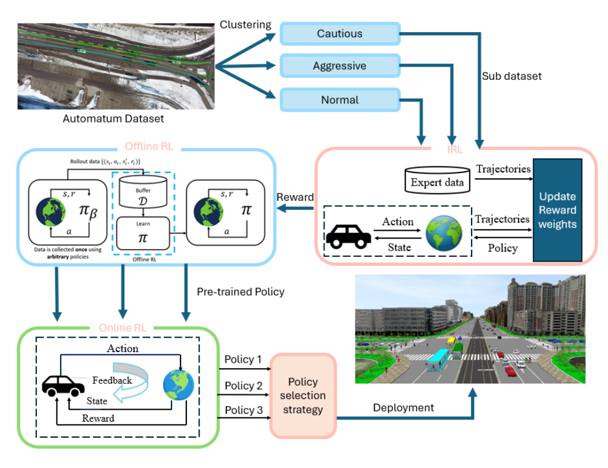

# HAD-Gen: Human-like and Diverse Scenario Generation

This repository contains the PyTorch implementation of our paper titled **"HAD-Gen: Human-like and Diverse Agent Behavior Modeling for Controllable Scenario Generation"**.

## 📊 Results

**HAD-Gen** can controllably generate human-like and diverse scenarios for autonomous vehicle testing and validation.

### Key Achievements
<div style="display: flex;">
  
  
</div>

**Superior Generalization**: Compared with baselines, our trained policies demonstrate the strongest generalization ability and can adapt to new real-world scenarios.

<p align="center">
  
</p>


## 🏗️ Method

### HAD-Gen Framework Overview

<p align="center">
  
</p>

**Workflow**:
1. **Data Clustering**: Driving behavior in the dataset is clustered into **Aggressive**, **Normal**, and **Cautious** categories
2. **Reward Reconstruction**: Each sub-dataset is used to reconstruct a reward function representing human driving behavior
3. **Policy Training**: Reconstructed rewards enable offline RL and MARL to generate driving policies for each cluster
4. **Scenario Generation**: Various driving policies are deployed in simulation using a policy selection strategy

## 📋 Requirements

This project uses the **[AUTOMATUM](https://automatum-data.com/)** dataset. Install the Python utility to interface with the data:

```bash
pip3 install openautomatumdronedata
```

## 🚀 Quick Start

### 1. Data Preparation Pipeline

Follow these steps in order:

1. **Clustering Analysis**
   ```bash
   python riskclustering.py
   ```
   *Generates clustering results saved as JSON files in `scenarios/configs/`*

2. **Feature Extraction**
   ```bash
   python feature_extraction_irl.py
   ```
   *Extracts feature values from dataset for IRL processing*

3. **IRL Training**
   ```bash
   python training_irl.py
   ```
   *Trains MaxEnt IRL and saves weights as `xxxtraining_log.pkl`*

4. **Feature Normalization**
   ```bash
   python feature_normalization.py
   ```
   *Calculates mean and standard deviation for feature normalization*

5. **Data Preprocessing**
   ```bash
   python preprocessing.py
   ```
   *Requires: `feature_normalization.pkl` and `XXXtraining_log.pkl`*

### 2. Model Training

Choose your training approach:

- **Offline RL**: `python td3bc_automatum.py`
- **SAC (Log-Replay)**: `python sac/model.py`
- **Online RL (Self-Replay)**: `python train_multicar.py`
  
## 📁 Project Structure

### Core Components
- **`/baselines`**: Implementation of baseline algorithms
- **`/evaluation`**: Metrics, unit tests, scoring, evaluation, and plotting code
- **`/simulator`**: Lightweight simulator and RL environment implementations

### Key Scripts
- **`evaluation/evaluation_methods.py`**: Evaluate baseline performance
- **`baselines/bc_baseline.py`**: Train Behavioral Cloning baseline
- **`baselines/model.py`**: Train SAC baseline
- **`simulator/lightweight_simulator.py`**: Run lightweight simulations

## ⚙️ Configuration

### Simulator Parameters
Set these parameters in `simulator/lightweight_simulator.py`:

| Parameter | Description | Options |
|-----------|-------------|---------|
| `spawn_method` | Data sampling method | `"dataset_one"` (micro analysis)<br>`"dataset_all"` (macro analysis) |
| `policy_type` | Policy selection | `"bc-all-obs-5_pi"` (BC)<br>`"sac_5_rl"` (SAC)<br>`"idm"` (IDM) |

### Installation

```bash
# Install project in development mode
pip install -e .

# Install PyTorch (from official website)
# Install additional requirements
pip install -r requirements.txt
```

### Troubleshooting

**OpenDRIVE Map Issues**: If you encounter errors about None header attributes, modify map files:
```xml
<!-- Change this line in each map file -->
<OpenDRIVE xmlns="http://www.opendrive.org">
<!-- To this -->
<OpenDRIVE>
```

## 📚 Citation

If you use this code in your research, please cite our paper:

```bibtex
@article{wang2025had,
  title={HAD-Gen: Human-like and Diverse Driving Behavior Modeling for Controllable Scenario Generation},
  author={Wang, Cheng and Kong, Lingxin and Tamborski, Massimiliano and Albrecht, Stefano V},
  journal={arXiv preprint arXiv:2503.15049},
  year={2025}
}
```

## 🤝 Contributing

We welcome contributions! Please feel free to submit issues, feature requests, or pull requests.

## 📄 License

This project is licensed under the terms specified in the LICENSE file.